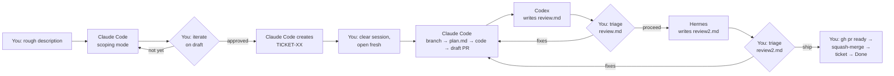

# End-to-End Workflow

The day-to-day flow once the multi-agent setup is live. **Claude Code (Opus 4.7)** implements; **Codex CLI (GPT-5.5 xhigh)** reviews first; **Hermes Agent (Kimi K2.6)** reviews second. One hypothetical ticket walked end-to-end so you can see every manual step you own.

> **Note:** Examples below use Linear as the ticket tracker and GitHub as the code host. Substitute your equivalents (Jira, GitHub Issues, Plane, etc.). The pattern doesn't depend on the specific tools.

---

## The cast

| Pane | Agent | Role | Reads | Writes |
|---|---|---|---|---|
| A0 | Claude Code — **scoping mode** | Drafts the ticket from your rough description | project `CLAUDE.md`, in-scope SPEC / READMEs, tracker team metadata | the ticket itself (via tracker MCP) |
| A | Claude Code — **implementing mode** | Writes code (fresh session, after ticket exists) | workspace `CLAUDE.md` + project `CLAUDE.md`, ticket, `plan.md`, codebase | code, commits, `plan.md`, draft PR |
| B | Codex CLI | First reviewer | workspace `AGENTS.md` + project `AGENTS.md`, ticket, `plan.md`, diff | `review.md` |
| C | Hermes Agent (Kimi K2.6) | Second reviewer | same as Codex + `review.md` | `review2.md` |

> [!IMPORTANT]
> Claude Code runs in **two distinct sessions** — scoping (A0) and implementing (A) — with a context-clear between them. Codex and Hermes are separate CLIs that never share a session with anyone. The handoff is **file-based**: ticket → `plan.md` → `review.md` → `review2.md`. All scratch files live at the project root; `review*.md` are gitignored.

---

## The flow



The merge step is **yours**, by design. Agents stop at draft-PR-opened and reviewer-findings-written.

---

## Hypothetical — `TICKET-42: add CSV export to /reports`

Your `/reports` API serves JSON. A teammate asks for CSV export so the data team can pull it straight into a spreadsheet. Ship it.

### 1. Scope the work — Claude Code drafts the ticket

Open a Claude Code session (cwd inside the target project). Give it a rough description in prose:

> *"I want to add a CSV export option to the /reports endpoint. The data team is currently parsing JSON in Excel which is fragile. Scope this for me as a ticket."*

**Claude Code does on its own (scoping mode):**
1. Light orientation only — reads project-local `CLAUDE.md` and any obvious in-scope docs (the reports route, the existing JSON serialization, the API README). It does **not** run the full implementation orientation.
2. Looks up the right tracker team, or picks up the prefix from project-local `CLAUDE.md`.
3. **Drafts the ticket in chat first** — title, body, acceptance criteria, out-of-scope notes. Does **not** create it in the tracker yet.

**Manual:** read the draft. Iterate freely.

- *"Add an acceptance criterion: integration test confirming `Content-Type: text/csv` on the response."*
- *"Drop the query-param renaming — that's scope creep."*
- *"Reword the title to imperative."*

When the draft matches your intent:

> *"Approved — create it."*

**Claude Code:** creates the ticket via its tracker MCP, returns the ID (e.g., `TICKET-42`).

### 1a. Clear the session — manual

The scoping session has eaten context and is holding a half-formed view of the problem. Close the Claude Code terminal. Open a fresh one.

> *"Work on TICKET-42."*

The rest of the flow now runs in implementing mode, with a clean context window.

> [!TIP]
> The ticket is the contract from this point on. Both Claude Code (in the fresh session) and the reviewers re-read it independently from the tracker before doing anything. Your paraphrase from the scoping chat is **not** ground truth. Only what was saved to the tracker matters.

### 2. Pane A — Claude Code (implementing mode)

Open Claude Code with `cwd = .../your-project/`. Say:

> *"Work on TICKET-42."*

**Claude Code does on its own:**
1. Reads workspace `CLAUDE.md` → project `CLAUDE.md`.
2. Orientation: `git remote -v`, `git branch --show-current`, scans `pyproject.toml` / `package.json`, identifies the project's test command.
3. Fetches TICKET-42 via the tracker MCP.
4. Reads any linked code-host issue.
5. Writes `plan.md` at the project root.

**Manual:** read `plan.md`. Approve or redirect.

- Bad plan: *"Don't add a new serialization library. Use the standard library."*
- Good plan: *"Looks right — go."*

**Claude Code then does on its own:**

6. **Creates the branch end-to-end** — looks up any code-host issue number linked to the ticket, then `git checkout -b 42-csv-export-on-reports` off `main`. No UI clicks, no IDE-side `git fetch`. (Fallback if no code-host issue is linked: `TICKET-42-csv-export` or `feat/csv-export`.)
7. Implements in small commits with messages like `add CSV serializer to /reports (TICKET-42)`.
8. Runs the project's gate (`pytest`, `npm test`, etc.); iterates until green.
9. Pushes and opens a **draft PR** via `gh pr create --draft` with the Summary + Test Plan body and `Closes TICKET-42` / `Closes #42`.

> [!WARNING]
> What Claude Code will **not** do: mark the PR ready for review, merge, or change ticket status.

### 3. Pane B — Codex (first reviewer)

Open Codex CLI in the same repo on the same branch.

> *"Review this branch against TICKET-42."*

**Codex does on its own:**
1. Reads workspace `AGENTS.md` → project `AGENTS.md`.
2. Fetches TICKET-42 from the tracker. Reads `plan.md`.
3. `git diff main...HEAD`, opens the changed files.
4. Runs the gate itself.
5. Writes findings to `review.md` at the project root, grouped by Blocker / Nit / Question.

**Manual:** read `review.md`. Decide which to act on.

If there are blockers, send them back to Claude Code:

> *"Read review.md and address the blockers. Update plan.md if the design shifts."*

Loop until `review.md` blockers are clean (or you've decided to override one).

### 4. Pane C — Hermes (second reviewer)

Open Hermes Agent in the same repo on the same branch.

> *"Review this branch against TICKET-42. review.md is Codex's pass — flag what it missed; skip duplicates."*

**Hermes does on its own:**
1. Reads workspace `AGENTS.md` → project `AGENTS.md`.
2. Reads the ticket, `plan.md`, the diff, and `review.md`.
3. Runs the gate itself.
4. Writes `review2.md` with only new findings (or disagreements with `review.md`).

**Manual:** read `review2.md`. Loop if needed.

### 5. Ship

When both review files are clean (or you've made the judgment calls):

```bash
gh pr ready                            # un-draft
gh pr merge --squash --delete-branch   # merge
rm -f review.md review2.md             # cleanup
```

Then in the tracker, move TICKET-42 → **Done**.

> [!NOTE]
> Ticket status is yours alone. No agent — Claude Code, Codex, or Hermes — touches it.

---

## Your manual surface, condensed

| Step | What you do | What no agent will do for you |
|---|---|---|
| Ticket scoping | Describe the work in prose; iterate on Claude Code's draft until aligned | Decide what the ticket should actually contain |
| Session reset | Clear the scoping session; open a fresh implementing session | Decide when context is dirty enough to reset |
| Plan approval | Read `plan.md`, redirect or approve | Decide whether the plan matches your intent |
| Reviewer launch | Start Codex CLI, then Hermes CLI | Auto-trigger themselves |
| Triage findings | Decide which Blockers / Nits / Questions to act on | Make the merge-readiness call |
| Un-draft + merge | `gh pr ready`, then squash-merge | Mark ready or merge |
| Ticket status | Move the ticket through to Done | Touch ticket state |

---

## File layout

- **Workspace `CLAUDE.md`** — implementer baseline; applies to every project in your workspace.
- **Workspace `AGENTS.md`** — reviewer baseline; same scope.
- **Project-local `CLAUDE.md`** — stack-specific overrides: gate commands, deploy hazards, schema conventions, framework quirks.
- **Project-local `AGENTS.md`** — same overrides, framed as "things to look for" rather than "things to do."
- **`plan.md`** — written by Claude Code, read by both reviewers. Local file at the project root. Not gitignored (useful design artifact in the repo; revisit if it starts cluttering diffs).
- **`review.md`** — Codex findings. Gitignored.
- **`review2.md`** — Hermes findings. Gitignored.

---

## Anti-patterns

> [!CAUTION]
> - **Implementing in the scoping session.** Same Claude Code session does not scope *and* implement. Always clear context between the two — otherwise the implementer carries the scoping conversation's assumptions instead of reading the ticket fresh.
> - **Editing the ticket in the tracker UI instead of in the draft.** Iterate before Claude Code saves it. Once it exists in the tracker, that's the contract; further edits should be deliberate, not cleanup.
> - **Telling Claude Code to "review your own work and ship."** That defeats the cross-model review. Claude does not self-review.
> - **Skipping Hermes when `review.md` is clean.** Hermes's specific job is to find what Codex missed; cross-model second opinion is the value, not redundancy.
> - **Letting any agent change ticket status.** Only you move it through the board.
> - **Letting Claude Code `gh pr ready` or merge.** Draft → ready → merge transitions are yours.
> - **Editing `review.md` to silence findings instead of fixing the code.**

---

## Variations on the basic flow

| Scenario | Adjustment |
|---|---|
| Both reviewers come back clean | Skip round 2; go straight to `gh pr ready` after `review2.md` says "Nothing to flag." |
| Reviewers disagree | `review2.md` states the disagreement plainly. You're the tiebreaker. |
| Diff touches a service that auto-deploys on merge | The plan must include the deploy implications. PR Test Plan must include a deploy dry-run. Don't merge while away from the keyboard. |
| Multi-package change | Bump version + update schema/docs in the same PR. Reviewer will flag if these aren't paired. |
| Trivial change (typo, doc fix) | `plan.md` optional. Single-pass review is fine; skip Hermes if it's a one-line change. |
| Hotfix to prod | Same flow, but compressed. Don't skip the reviewers; do skip the long manual E2E if the change is mechanical. |

---

## Living with the workflow

A short list of how this bites once it's daily. Re-read this monthly for the first quarter.

> [!WARNING] Session reset is the #1 failure mode
> After scoping mode creates the ticket, **physically close the Claude Code terminal** before opening the implementing session. If you stay in the same session, Claude leans on scoping-conversation memory instead of re-reading the ticket fresh — and the implementer's first job (ticket = ground truth) silently gets skipped.

> [!TIP] Standardize your approval phrase
> In scoping mode Claude Code waits for explicit approval before creating the ticket. Pick exactly one phrase (e.g., *"approved — create it"*) and only use it for ticket approval. *"Looks good"* / *"yeah that works"* are ambiguous and may fire it early.

> [!NOTE] `plan.md` is a living doc
> Claude Code updates `plan.md` as review fixes change the design. If `plan.md` and the diff disagree, that's drift; Claude Code should have updated the plan. Reviewers treat it as current contract, not original intent.

> [!TIP] Cost / latency vs. value
> Three reviewer rounds per ticket adds up. For trivial changes, skip Hermes per the Variations table. Reassess monthly: if `review2.md` is consistently "nothing to flag," raise the bar for invoking the second reviewer.

> [!WARNING] Reviewer model drift
> Codex (GPT-5.5 xhigh) and Hermes (Kimi K2.6) get silent model updates. Pin versions in your CLI configs where possible. If review quality changes noticeably, model drift is the usual cause before docs-rot is.

> [!WARNING] Branch protection & self-approval
> Most code hosts don't let a PR author approve their own PR. If `main` has branch protection requiring approvals, decide upfront: (a) loosen protection for solo work, (b) require real-human approval, or (c) use a service account. **Check this before your first ticket** — easy to discover at the merge step otherwise.

### First-month signals to track

- **Are Hermes findings adding value beyond Codex?** If `review2.md` is mostly empty, lower its frequency.
- **Are scoping-mode tickets noticeably better than what you'd write?** If yes → real leverage. If no → tune the scoping prompt in `CLAUDE.md`.
- **How often do reviewers catch real bugs vs. nits?** Low signal-to-noise → drop a reviewer. High → keep both, consider a third for risky areas.
- **Where are you restating conventions in chat?** That's a doc bug. Update the relevant `CLAUDE.md` / `AGENTS.md` so the next session inherits the fix.

---

## Quick-reference commands

```bash
# Claude Code does this; do it manually if you ever need to
git checkout -b feat/<short-desc>            # or <issue#>-<slug>

# gate (project-specific; what Claude Code runs locally)
pytest                                        # or: npm test, cargo test, go test ./...

# Claude Code pushes and opens the draft PR
git push -u origin <branch>
gh pr create --draft --title "<scope>: <desc> (TICKET-XX)" --body-file pr_body.md

# you ship
gh pr ready
gh pr merge --squash --delete-branch
rm -f review.md review2.md
# then in the tracker: TICKET-XX → Done
```
